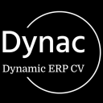
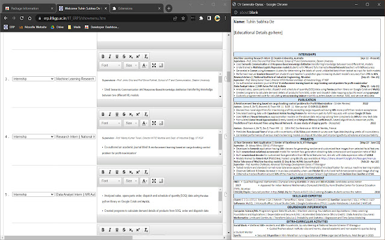

<!-- PROJECT SHIELDS -->
<!-- https://www.markdownguide.org/basic-syntax/#reference-style-links-->

[![Contributors][contributors-shield]][contributors-url]
[![Forks][forks-shield]][forks-url]
[![Stargazers][stars-shield]][stars-url]
[![Issues][issues-shield]][issues-url]
[![MIT License][license-shield]][license-url]
[![Wiki][wiki-shield]][wiki-url]

<!-- PROJECT LOGO -->
 
<!-- UPDATE -->

  

  <h3 align="center">Dynac</h3>

  

  <!-- UPDATE -->
    <i>The dynamic CV builder for IIT KGP ERP</i>
     
    <a href="https://github.com/metakgp/dynac"><strong>Explore the docs »</strong></a>
     
     
    <a href="https://github.com/metakgp/dynac/issues">Report Bug</a>
    ·
    <a href="https://github.com/metakgp/dynac/issues">Request Feature</a>
  

<!-- TABLE OF CONTENTS -->

Table of Contents

- [About The Project](#about-the-project)
  - [Supports](#supports)
- [Getting Started](#getting-started)
  - [Prerequisites](#prerequisites)
  - [Installation](#installation)
- [Usage](#usage)
- [Contact](#contact)
- [Acknowledgements](#acknowledgments)
- [Additional documentation](#additional-documentation)

<!-- ABOUT THE PROJECT -->

## About The Project

<!-- UPDATE -->

  

_Dynac is a browser extension developed specially for dynamic and real-time resume/CV formatting in IIT Kharagpur ERP system. It reduces the problems of space management and repeated necessity of updating CV on ERP just to view the changes made. The ERP CV making portal is available under the CDC tab and is active only during pre-internships and pre-placement seasons._

(<a href="#top">back to top</a>)

### Supports:

- [Chromium Based Browsers](<https://en.wikipedia.org/wiki/Chromium_(web_browser)#Browsers_based_on_Chromium>)

(<a href="#top">back to top</a>)

<!-- GETTING STARTED -->

## Installation

To install the extension and use it, follow one of the steps described below.

### Web Store (Recommended)

_The extension is published on the Chrome Web Store [here][web-store-url]. Follow the link to install directly._

### Manual (Advanced Users)

_In order to install the extension on any of the browser - **manually** - you will have to either [download](https://blog.hubspot.com/website/download-from-github?hubs_content=blog.hubspot.com/website/download-from-github&hubs_content-cta=downloading%20a%20repository#repository) or [clone](https://docs.github.com/en/repositories/creating-and-managing-repositories/cloning-a-repository) this repository._

1. Open new tab and type `chrome://extensions` on search bar.
2. Toggle the **DEVELOPER MODE** on top right corner.
3. Click **LOAD UNPACKED** option, browse to the cloned folder and select the project folder.

> **Warning** You have to select the whole folder not just any file.

(<a href="#top">back to top</a>)

<!-- USAGE EXAMPLES -->

## Usage

<!-- UPDATE -->

Please refer to the [website][website-url] for instructions about the usage of the extension.

(<a href="#top">back to top</a>)

<!-- CONTACT -->

## Contact

📫 Metakgp -

(<a href="#top">back to top</a>)

<!-- ACKNOWLEDGMENTS -->

## Acknowledgments

- [Choose an Open Source License](https://choosealicense.com)
- [Img Shields](https://shields.io)
<!-- UPDATE -->

(<a href="#top">back to top</a>)

## Maintainer(s)

- [Tuhin Subhra De](https://github.com/Gituhin)

(<a href="#top">back to top</a>)

<!-- MARKDOWN LINKS & IMAGES -->

[contributors-shield]: https://img.shields.io/github/contributors/metakgp/dynac.svg?style=for-the-badge
[contributors-url]: https://github.com/metakgp/dynac/graphs/contributors
[forks-shield]: https://img.shields.io/github/forks/metakgp/dynac.svg?style=for-the-badge
[forks-url]: https://github.com/metakgp/dynac/network/members
[stars-shield]: https://img.shields.io/github/stars/metakgp/dynac.svg?style=for-the-badge
[stars-url]: https://github.com/metakgp/dynac/stargazers
[issues-shield]: https://img.shields.io/github/issues/metakgp/dynac.svg?style=for-the-badge
[issues-url]: https://github.com/metakgp/dynac/issues
[license-shield]: https://img.shields.io/github/license/metakgp/dynac.svg?style=for-the-badge
[license-url]: https://github.com/metakgp/dynac/blob/master/LICENSE.txt
[wiki-shield]: https://custom-icon-badges.demolab.com/badge/metakgp_wiki-grey?logo=metakgp_logo&logoColor=white&style=for-the-badge
[wiki-url]: https://wiki.metakgp.org
[web-store-url]: https://chrome.google.com/webstore/detail/dynac-kgp-erp/hlfjmfmnklaknaahfeofbcifgemgaokd
[website-url]: https://sites.google.com/view/dynac-kgp-erp
